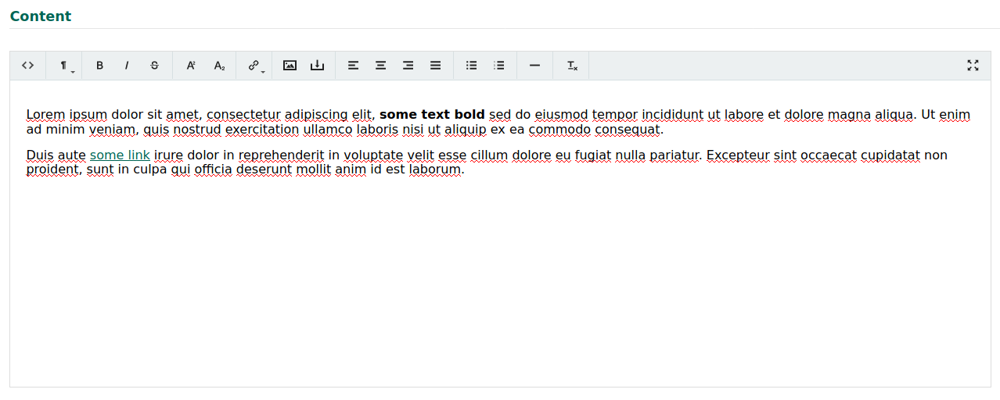

# Leafiny_Trumbowyg

The module add the Trumbowyg WYSIWYG editor in admin.

**Warning:**

- Module was removed from Leafiny in 1.3.0 and replaced by Markdown Editor
- Module is no longer maintained
- Module add jQuery 3.5.1 in backend (Trumbowyg need jQuery)

# Installation

Copy `Leafiny_Trumbowyg` into your Leafiny `modules` directory, and remove `Leafiny_Editor` module.